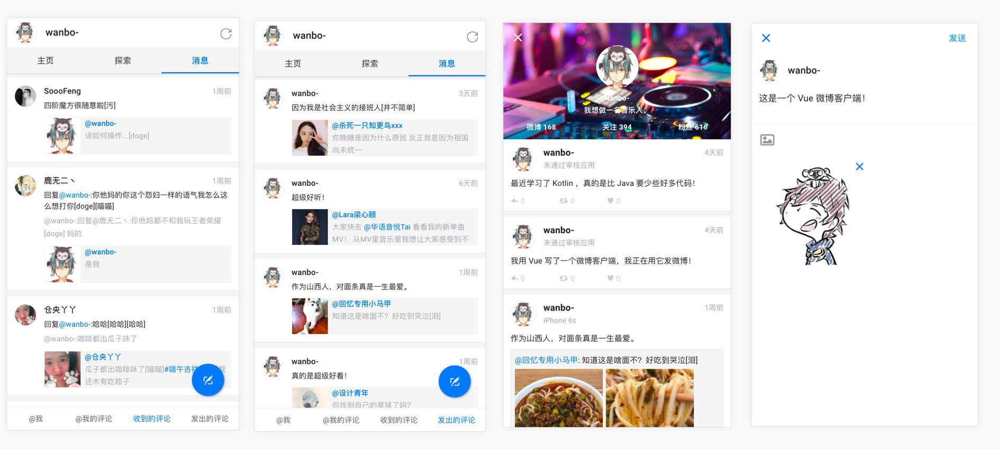
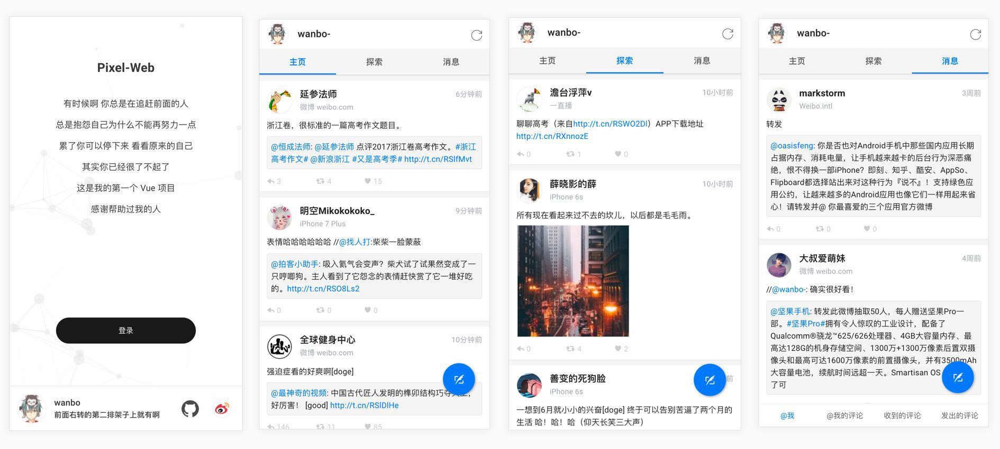
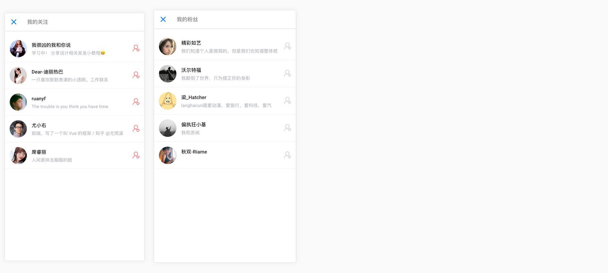

# weblog

## 项目介绍

该项目为一个社交app项目，前端主要使用的`react`,  `redux`, `react-router`, `react-router-dom`

如下图所示：








## 项目结构

```markdown
|-- weblog
    |-- .gitignore
    |-- package.json
    |-- yarn.lock
    |-- config					webpack配置文件
    |   |-- env.js
    |   |-- getHttpsConfig.js
    |   |-- modules.js
    |   |-- paths.js
    |   |-- pnpTs.js
    |   |-- webpack.config.js
    |   |-- webpackDevServer.config.js
    |   |-- jest
    |       |-- cssTransform.js
    |       |-- fileTransform.js
    |-- public
    |   |-- favicon.ico
    |   |-- index.html
    |-- scripts
    |   |-- build.js
    |   |-- start.js
    |   |-- test.js
    |-- src
        |-- index.js
        |-- index.scss
        |-- api
        |   |-- index.js
        |-- assets
        |   |-- images
        |   |   |-- .gitkeep
        |   |-- styles			项目中统一使用sass，并且var中会用于定义变量，后期便于主题修改
        |       |-- reset.scss
        |       |-- var.scss
        |-- hoc					用于存放高阶
        |   |-- page
        |   |   |-- index.js
        |   |-- tabbar
        |       |-- index.js
        |-- package				用于存放通用组件，通常与业务无关
        |   |-- .gitkeep
        |   |-- NavigationBar
        |   |   |-- index.js
        |   |   |-- index.scss
        |   |-- Tabbar
        |       |-- index.js
        |       |-- index.scss
        |-- router				路由文件，app的tabbar在此处只是为了便于渲染
        |   |-- index.js
        |   |-- tabbar.js
        |-- store				redux存放，统一管理是不希望过于松散不便管理
        |   |-- index.js
        |   |-- action-type
        |   |   |-- index.js
        |   |-- reducer
        |       |-- index.js
        |-- utils				所有的工具方法可以放于此处，包括之后使用的axios或fetch
        |   |-- index.js
        |-- views				视图文件夹
            |-- Index
                |-- index.js
```


## 启动方式

```bash
git clone https://github.com/cieme/react-admin-demos

npm install

# 启动本地服务 一般端口为3000
npm run start

# 打包指令
npm run build

```


## 项目规划

- 登录注册
- 首页
  - 微博列表
    - 关注列表/推荐列表
    - 关注博主
    - 点赞
    - 评论 -- 点击进入详情页，滚动至评论区域
    - 不感兴趣
    - 收藏
  - 新建一篇微博内容
    - 图片/视频上传
    - 尝试使用emoji
    - @好友
    - 定位
    - #话题
    - 设置权限 --谁可见
      - 公开
      - 粉丝
      - 仅自己
  - 微博详情
    - 关注
    - 分享给好友 -- weblog好友
    - 评论
    - 点赞
    - 不感兴趣
    - 评论点赞
    - 评论折叠/展开
- 搜索
  - 搜索历史
  - 热搜 -- 可由后台设置
  - 模糊搜索
    - 搜索项：综合，用户，同城，话题
- 消息
  - 点赞消息
  - @我的
  - 聊天消息列表
    - 可滑动删除
  - 消息内容 -- socket.io
  - 消息设置
    - 拉黑聊天
- 个人中心
  - 个人信息展示
    - 发文数量
      - 个人微博列表
        - ...功能与首页的类似
    - 关注数量
      - 关注列表
        - 取关
        - 点击进入对方主页
    - 粉丝数
      - 列表
        - 关注
        - 点击进入对方主页
        - 拉黑
    - 我的相册
      - 即发文使用的图片库
    - 我赞别人的
      - 列表
    - 我的收藏
    - 我的黑名单
    - 设置
      - 账号管理	
      - 修改密码
      - 更换昵称，头像
      - 关于我们
      - 退出登录
  - 个人主页
    - ...就不列举了

> 只是列举了一下功能，并不是要全部完成，量力而行即可，
>
> 有的功能可能没有图，可以抄weibo或者任意自己喜欢的产品